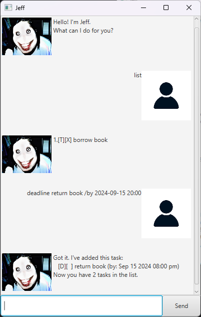
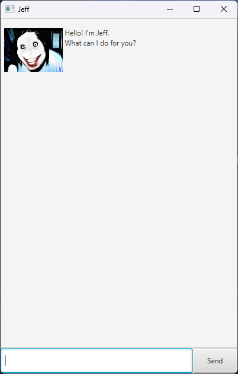

# Jeff User Guide

Jeff is a chatbot for managing tasks (To-Do, Deadline, Event) using a Command Line Interface.

## Quick Start

1. Ensure you have Java 17 installed in your computer.

2. Download the latest `.jar` file from [here](https://github.com/Nicholaskoh1/ip/releases/download/v0.2/Jeff.jar).

3. Copy the file to the folder you want to use as the home folder for your Chatbot.

4. Open a command terminal, `cd` into the folder you put the jar file in,
and use the `java -jar Jeff.jar` command to run the application.

5. A GUI similar to the below should appear in a few seconds.

## Features

Notes about the command format:
- Words in `UPPER_CASE` are the parameters to be supplied by the user. 
  e.g. In `todo DESCRIPTION`, `DESCRIPTION` is a parameter which can be used as `todo return book`
- `HH:mm` represents a 24-hour clock time and `hh:mm am/pm` represents a 12-hour clock time. 
  e.g. `HH:mm` can be used as `17:00` and `hh:mm am/pm` can be used as `05:00 pm`

### Adding a To-Do Task: `todo`

Adds a to-do task to the task list.

Format: `todo DESCRIPTION`

Shortcut: `t DESCRIPTION`

Examples:
- `todo borrow book`
- `t return book`

### Adding a Deadline Task: `deadline`

Adds a deadline task to the task list.

Format: `deadline DESCRIPTION /by DATE_AND_TIME`

Shortcut: `dl DESCRIPTION /by DATE_AND_TIME`

- `DATE_AND_TIME` must be in the format `yyyy-mm-dd HH:mm` or `yyyy-mm-dd hh:mm am/pm`.
- `DATE_AND_TIME` must be in the future.

Examples:
- `deadline submit assignment /by 2024-09-14 20:00`
- `deadline wash clothes /by 2024-10-09 06:00 pm`
- `dl return book /by 2024-11-17 07:00`

### Adding an Event Task: `event`

Adds an event task to the task list.

Format: `event DESCRIPTION /from START_DATE_AND_TIME /to END_DATE_AND_TIME`

Shortcut: `e DESCRIPTION /from START_DATE_AND_TIME /to END_DATE_AND_TIME`

- `START_DATE_AND_TIME`/`END_DATE_AND_TIME` must be in the format 
`yyyy-mm-dd HH:mm` or `yyyy-mm-dd hh:mm am/pm`.
- `END_DATE_AND_TIME` must be in the future.
- `START_DATE_AND_TIME` must be before `END_DATE_AND_TIME`. 

Examples:
- `event project meeting /from 2024-09-14 18:00 /to 2024-09-14 20:00`
- `event carnival /from 2024-09-20 08:00 am /to 2024-09-21 08:00 pm`
- `e school /from 2024-09-14 06:00 /to 2024-09-14 18:00`

### Listing all Tasks: `list`

Shows a list of all tasks.

Format: `list`

Shortcut: `l`

### Exiting the Program: `bye`

Exits the program.

Format: `bye`

Shortcut: `b`

### Locating Tasks by Keyword: `find`

Finds tasks whose descriptions contain the keyword.

Format: `find KEYWORD`

Shortcut: `f KEYWORD`

- `KEYWORD` can be words, phrases or characters. 
  e.g. `book`, `bo`, `borrow book` will all find the task with description `borrow book`
- The search is case-insensitive. e.g. `book` will match `Book`.

Examples:
- `find book` finds all tasks whose descriptions contain the word `book` or `Book`.
- `find b` finds all tasks whose descriptions contain the character `b` or `B`.

### Locating Tasks by Date: `date`

Finds deadline tasks which are due on the specified date and events that are happening on
the specified date.

Format: `date DATE`

Shortcut: `dt DATE`

- `DATE` must be in the format `yyyy-mm-dd`.

Examples:
- `date 2024-09-14` finds all deadline tasks that are due on 14 Sept 2024 and all events that are
happening on 14 Sept 2024.
- `dt 2024-09-09` finds all deadline tasks that are due on 9 Sept 2024 and all events that are
happening on 9 Sept 2024.

### Deleting a Task: `delete`

Deletes the specified task from the task list.

Format: `delete TASK_NUMBER`

Shortcut: `dd TASK_NUMBER`

- Deletes the task at the specified `TASK_NUMBER`.
- `TASK_NUMBER` is the index number shown in the displayed task list.
- `TASK_NUMBER` must be a positive integer 1, 2, 3, ...
- `TASK_NUMBER` must exist for it to work.

Examples:
- `delete 2` deletes the 2nd task in the task list.
- `dd 1` deletes the 1st task in the task list.

### Marking a Task as Completed: `mark`

Marks the specified task as completed from the task list.

Format: `mark TASK_NUMBER`

Shortcut: `m TASK_NUMBER`

- Marks the task at the specified `TASK_NUMBER` as completed.
- `TASK_NUMBER` is the index number shown in the displayed task list.
- `TASK_NUMBER` must be a positive integer 1, 2, 3, ...
- `TASK_NUMBER` must exist for it to work.
- Command only works if the task has not been marked as completed yet.

### Marking a Task as not Completed: `unmark`

Marks the specified task as not completed from the task list.

Format: `unmark TASK_NUMBER`

Shortcut: `u TASK_NUMBER`

- Marks the task at the specified `TASK_NUMBER` as not completed.
- `TASK_NUMBER` is the index number shown in the displayed task list.
- `TASK_NUMBER` must be a positive integer 1, 2, 3, ...
- `TASK_NUMBER` must exist for it to work.
- Command only works if the task has already been marked as completed beforehand.

### Saving the Data

All tasks data are saved in the hard disk automatically after any command that changes the data.
  There is no need to save manually.

### Editing the Data File
Tasks data are saved automatically as a txt file `[JAR file location]/data/tasks.txt`.
Advanced users are welcome to update the data directly by editing that data file.

Caution: 
  If your changes to the data file makes its format invalid, the program will no longer work
until you make the file format valid again, or you delete the data file. 
Hence, it is recommended to take a backup of the file before editing it.

Furthermore, certain edits can cause the chatbot to behave in unexpected ways 
(e.g., if a value entered is outside the acceptable range). 
Therefore, edit the data file only if you are confident that you can update it correctly.